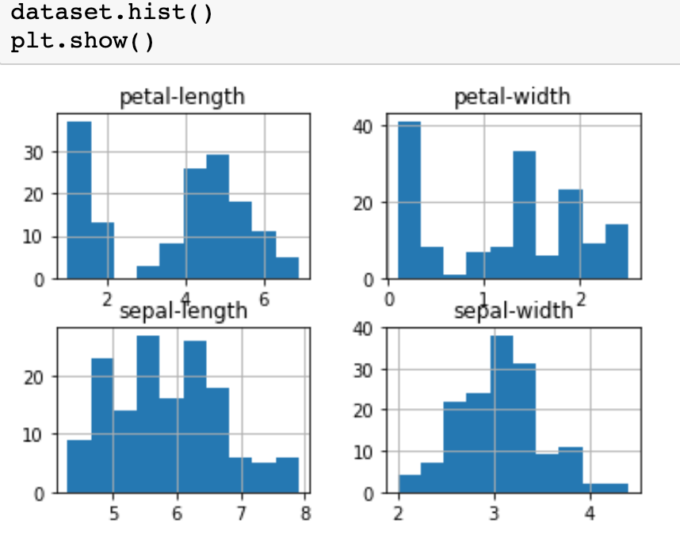

# IrisFlowerClassification
My approach on the classic Iris Classification Problem using Pandas, Matplotlib, and SKLearn. 

# Technology and Notes
Built using SKLearn's metrics and linear models. 
I made an effort to document the iPython Notebook well in the event that future users wanted to use my project as a guide. 

# Process # 

# Results # 

## Support ## 

If you find any of my projects helpful/inspiring and would like to support me, please do so [here](https://venmo.com/Micah-Yong "Venmo")
